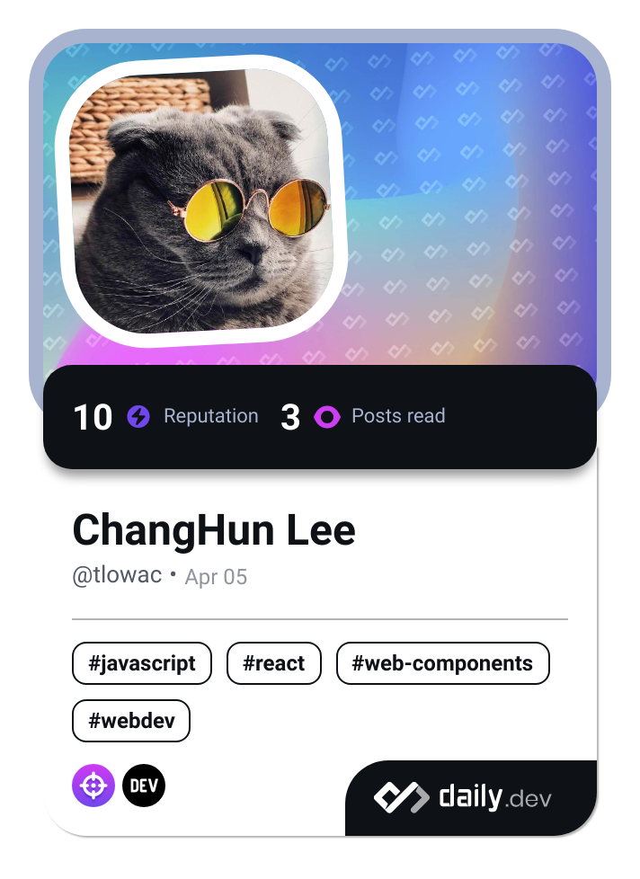

<!-- daily.dev / #DevCard -->

  

<!-- visitor count -->

 
<!--    -->
  

 

<!-- BLOG-POST-LIST:START -->
- [[IDE 99% 에러잡기] cursor ide - cursor . 명령어 &amp;quot;zsh: command not found: cursor&amp;quot;](https://helicopter55.tistory.com/87)
- [[Github 99% 에러해결하기] Github Action 티스토리 블로그 RSS 406 Error - Not Acceptable 에러](https://helicopter55.tistory.com/85)
- [[vscode 1% 이해하기] Jetbrains Mono 폰트 vscode 적용하기 &lpar;feat. Font Ligature&rpar;](https://helicopter55.tistory.com/84)
- [[사이드프로젝트] 프로필 링크 랜딩 페이지 제작하기](https://helicopter55.tistory.com/83)
<!-- BLOG-POST-LIST:END -->

<!-- metrics -->
<!--

  

-->

<!--

  
    

   
    
  
  
    
  

 -->

<!-- <h1 align="center">
   
  Hey! Nice to see you.
</h1>

 
  Visitor count 
  

## 🙋🏻‍♂️ About me

  I'm Changhun, junior fullstack developer from 
   
  <b>Seoul, Korea</b>

 

## 🛠 Tech Stack

 

## ⚡ Github Stat

  
    

 

## 🖥️ Side projects

  

    
      
    
    
      
    
  

  

    
      
    
    
      
    
  

 

<h3>🔍 Where to find me</h3>

 
<!--  -

 -->

<!-- 
Click Here To See My Resume
 -->

<!-- 

 -->

